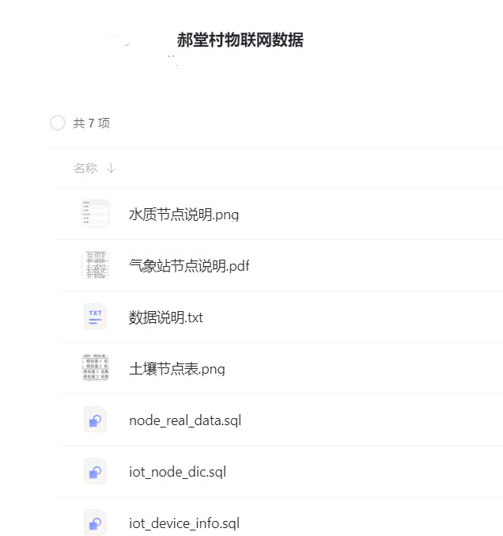

# Intelligent Agriculture Internet of Things Data Set - Meteorology + Soil Moisture + Water Quality

Download the data set from Alibaba Cloud Disk.
This dataset contains real-time monitoring data from three million agricultural Internet of Things devices, reporting every 30 seconds, covering three categories: meteorological stations, water quality monitoring stations, and soil moisture stations, totaling seven devices.
The data is authenticated and comes from Henan Province's Xinyang City.
The dataset includes detailed usage instructions and locations for the devices.
It can be used for scientific research or to demonstrate system setup.
Measured contents include: wind force, direction, temperature, humidity, rainfall, soil pH, soil temperature, soil moisture, dissolved oxygen, turbidity, ammonia concentration, PM2.5, PM10, carbon dioxide, radiation, pressure, etc.

## Images

Here is a pay link on Stripe ( https://buy.stripe.com/3cs8yP7sY87d0vu9AB ). Please contact me lonlonago@foxmail.com after funding $89, and I will send you a complete data files , thank you!

